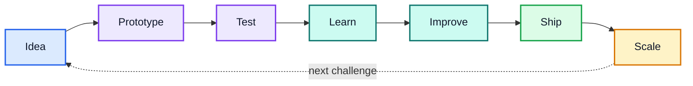

<div align="center">


[](https://git.io/typing-svg)

<a href="https://github.com/asukamiyachi">
  
</a>


</div>

---

## 👋 About me

```text
Name        Asuka Miyachi / 宮地 飛嘉
School      神山まるごと高専 / Kamiyama Marugoto College
Focus       Product · AI · Robotics · Software · Manufacturing
Mindset     Think big → build small → test → iterate → scale
Goal        Build products and companies with global-scale impact
```

アイデアを考えるだけで終わらせず、**実際に動くものまで作る**ことを大切にしています。

ソフトウェア、AI、ロボティクス、ものづくり、サービス設計を横断しながら、
「技術をどう社会で使われるプロダクトに変えるか」を学び、試しています。

---

## 🚀 What I'm working on

<table>
<tr>
<td width="50%" valign="top">

### 🤖 AI / Physical AI

- AIを組み込んだプロダクト開発
- Local AI / LLM experiments
- Physical AI / robotics integration
- AIを「機能」ではなく「体験」に落とす設計

</td>
<td width="50%" valign="top">

### 📱 Product Development

- Flutter / Firebase アプリ開発
- SwiftUI / macOS app development
- UI / UX improvement
- GitHub Issues / PR を使った開発運用

</td>
</tr>
<tr>
<td width="50%" valign="top">

### 🦾 Robotics / Manufacturing

- FRC / FTC robotics
- WPILib / robot programming
- Digital manufacturing
- Hardware × Software × AI

</td>
<td width="50%" valign="top">

### 🌍 Entrepreneurship

- 新しい市場・サービスの探索
- Platform business
- User research / behavior design
- Scaleするプロダクト構造の研究

</td>
</tr>
</table>

---

## 🧰 Tech & Tools

<div align="center">

### Languages / Frameworks


### Backend / Dev Tools


### Environment


</div>

---

## 🧪 Selected repositories

<div align="center">

<a href="https://github.com/asukamiyachi/physical-ai-sandbox">
  
</a>
<a href="https://github.com/asukamiyachi/local-ai-debate">
  
</a>

<a href="https://github.com/asukamiyachi/Ghostty-Terminal">
  
</a>
<a href="https://github.com/asukamiyachi/hammerspoon-workflow">
  
</a>

<a href="https://github.com/asukamiyachi/yajinushi">
  
</a>

</div>

---

## 🧭 How I build



> **Think big. Start concrete. Ship. Learn. Repeat.**

---

## 📚 Currently learning

- 🧠 AI / LLM application design
- 🤖 Robotics & Physical AI
- ⚙️ Manufacturing and hardware systems
- 📱 Flutter / Firebase product development
- 🖥️ SwiftUI / macOS development
- 🎨 Product design / UI / UX
- 📈 Business models, platforms, and growth
- 🌐 English for global communication

---

## 📊 GitHub

<div align="center">


</div>

---

## 🔭 Direction

```text
Software ─┐
AI       ─┼─> Useful products ─> New behavior ─> New markets ─> Global impact
Robotics ─┤
Design   ─┘
```

I want to keep expanding the range of things I can build — from code on a screen to systems that interact with the physical world.

The long-term challenge is not simply to make more software. It is to understand **technology, people, business, and scale** well enough to create something that changes how the world works.

---

<div align="center">

### ⚡ Build → Learn → Improve → Repeat


</div>
