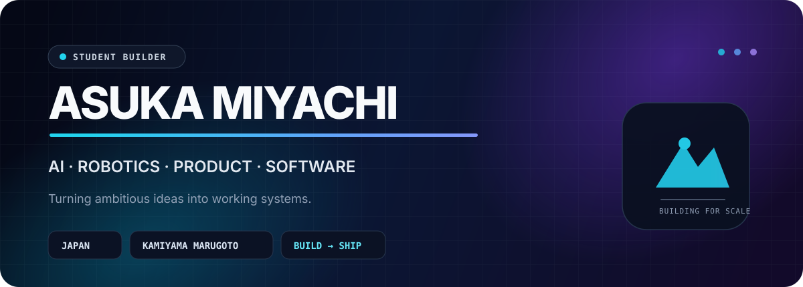
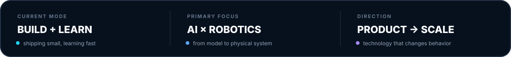
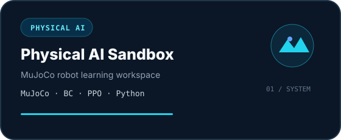
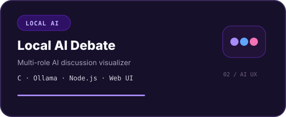
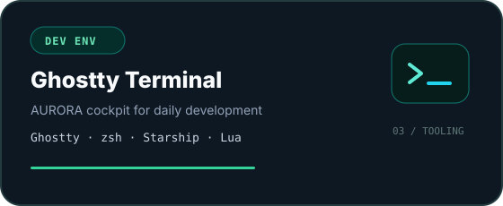
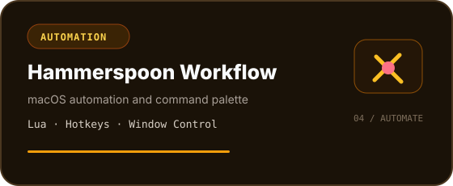
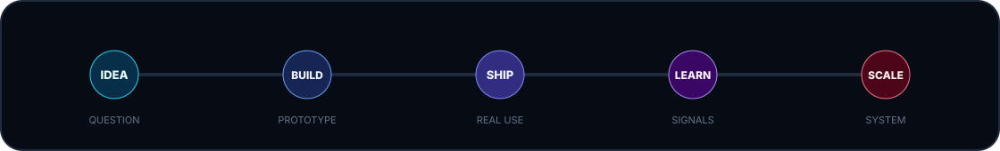
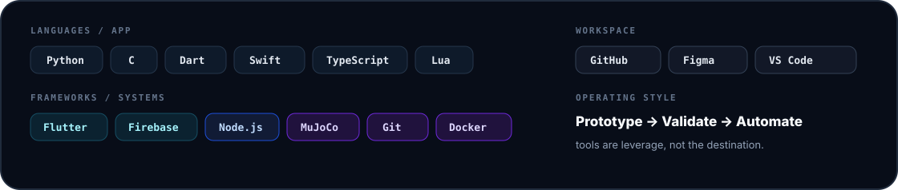

<div align="center">



<br/>



<br/>

<a href="#selected-work"><b>WORK</b></a>
&nbsp;&nbsp;&nbsp;&nbsp;
<a href="#build-system"><b>SYSTEM</b></a>
&nbsp;&nbsp;&nbsp;&nbsp;
<a href="#stack"><b>STACK</b></a>
&nbsp;&nbsp;&nbsp;&nbsp;
<a href="#now"><b>NOW</b></a>
&nbsp;&nbsp;&nbsp;&nbsp;
<a href="https://github.com/asukamiyachi?tab=repositories"><b>ALL REPOS ↗</b></a>

<br/><br/>

**Student builder at Kamiyama Marugoto College.**  
I build software, AI systems, robotics experiments, and tools — then learn from what actually works.

</div>

---

<a id="selected-work"></a>
<sub>01 / SELECTED WORK</sub>
## Projects built to learn from reality

<table>
<tr>
<td width="50%">
<a href="https://github.com/asukamiyachi/physical-ai-sandbox">

</a>
</td>
<td width="50%">
<a href="https://github.com/asukamiyachi/local-ai-debate">

</a>
</td>
</tr>
<tr>
<td width="50%">
<a href="https://github.com/asukamiyachi/Ghostty-Terminal">

</a>
</td>
<td width="50%">
<a href="https://github.com/asukamiyachi/hammerspoon-workflow">

</a>
</td>
</tr>
</table>

<p align="right"><sub>Each card links directly to the repository ↗</sub></p>

---

<a id="build-system"></a>
<sub>02 / BUILD SYSTEM</sub>
## Ambitious direction. Concrete iteration.



<table>
<tr>
<td width="25%" valign="top"><b>AI</b><br/><sub>LLM applications<br/>Local AI<br/>Behavior Cloning<br/>Reinforcement Learning</sub></td>
<td width="25%" valign="top"><b>ROBOTICS</b><br/><sub>Physical AI<br/>MuJoCo<br/>FRC / FTC<br/>Hardware × Software</sub></td>
<td width="25%" valign="top"><b>PRODUCT</b><br/><sub>Flutter<br/>Firebase<br/>UI / UX<br/>User research</sub></td>
<td width="25%" valign="top"><b>SYSTEMS</b><br/><sub>macOS tooling<br/>Automation<br/>Git / GitHub<br/>Developer experience</sub></td>
</tr>
</table>

> **Think big. Start concrete. Ship something. Learn from reality. Improve the system.**

---

<a id="stack"></a>
<sub>03 / STACK</sub>
## Tools I use to turn ideas into systems



---

<a id="now"></a>
<sub>04 / NOW</sub>
## What I am optimizing for now

```text
BUILDING     Physical AI systems and developer tools
LEARNING     AI / robotics / manufacturing / product design
EXPLORING    Products that can create new behavior and new markets
PRINCIPLE    Ambition in the goal, concreteness in the next action
```

---

<sub>05 / DIRECTION</sub>
## From code on a screen to systems in the world

<table>
<tr>
<td width="58%" valign="top">

I want to understand enough of **technology, people, business, and scale** to build products that move beyond a demo and become systems people actually use.

The projects here are experiments toward that direction: AI that acts, robotics that learns, interfaces that feel intentional, and tools that remove friction from building.

</td>
<td width="42%" valign="top">

```text
SOFTWARE ─┐
AI       ─┼─→ PRODUCT
ROBOTICS ─┤      ↓
DESIGN   ─┘   BEHAVIOR
              ↓
            MARKET
              ↓
            IMPACT
```

</td>
</tr>
</table>

---

<div align="center">

### Build → Ship → Learn → Repeat

<sub>Asuka Miyachi · Kamiyama Marugoto College · Japan</sub>

</div>
