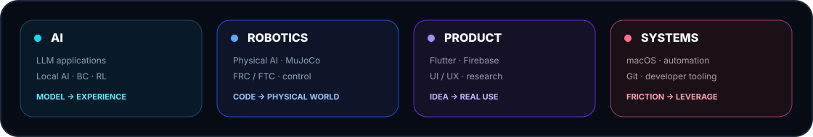
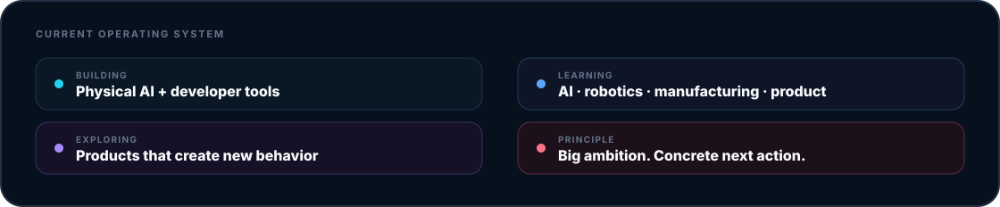
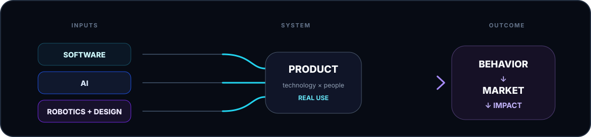
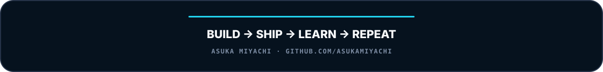

 

 

<a href="#selected-work"><b>WORK</b></a>
&nbsp;&nbsp;&nbsp;&nbsp;
<a href="#build-system"><b>SYSTEM</b></a>
&nbsp;&nbsp;&nbsp;&nbsp;
<a href="#stack"><b>STACK</b></a>
&nbsp;&nbsp;&nbsp;&nbsp;
<a href="#now"><b>NOW</b></a>
&nbsp;&nbsp;&nbsp;&nbsp;
<a href="https://github.com/asukamiyachi?tab=repositories"><b>ALL REPOS ↗</b></a>

  

**Student builder at Kamiyama Marugoto College.**  
I build software, AI systems, robotics experiments, and tools — then learn from what actually works.

  

01 / SELECTED WORK
## Projects built to learn from reality

<table>
<tr>
<td width="50%">

</td>
<td width="50%">

</td>
</tr>
<tr>
<td width="50%">

</td>
<td width="50%">

</td>
</tr>
</table>

Each card links directly to the repository ↗

  

02 / BUILD SYSTEM
## Ambitious direction. Concrete iteration.

 

 

<b>Think big. Start concrete. Ship something. Learn from reality. Improve the system.</b>

  

03 / STACK
## Tools I use to turn ideas into systems

  

04 / NOW
## What I am optimizing for now

  

05 / DIRECTION
## From code on a screen to systems in the world

 

I want to understand enough of **technology, people, business, and scale** to build products that move beyond a demo and become systems people actually use. The projects here are experiments toward that direction: AI that acts, robotics that learns, interfaces that feel intentional, and tools that remove friction from building.

  

