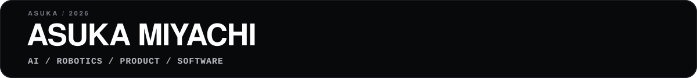

<picture>
  <source media="(max-width: 600px)" srcset="./assets/hero-v3-mobile.svg" />
  
</picture>

<h3 align="center">TOOLBOX</h3>

  

  

&nbsp;&nbsp;&nbsp;&nbsp;

&nbsp;&nbsp;&nbsp;&nbsp;

&nbsp;&nbsp;&nbsp;&nbsp;

&nbsp;&nbsp;&nbsp;&nbsp;

&nbsp;&nbsp;&nbsp;&nbsp;

<!-- Full service inventory: docs/service-inventory.md -->
