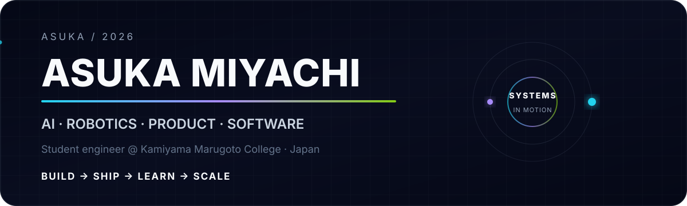
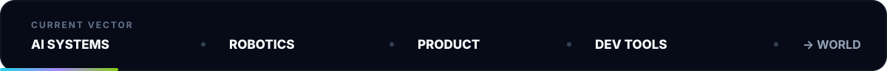

 

<h3 align="center">LIVE ACTIVITY</h3>

Auto-generated from GitHub activity and refreshed daily.

 

<h3 align="center">TOOLBOX</h3>

  

  

<code>OPENAI</code>
&nbsp;·&nbsp;
<code>QWEN</code>
&nbsp;·&nbsp;
<code>BONSAI AI</code>
&nbsp;·&nbsp;
<code>HUGGING FACE</code>
&nbsp;·&nbsp;
<code>GHOSTTY</code>
&nbsp;·&nbsp;
<code>GOOGLE SERVICES</code>

  

<code>AI</code>
&nbsp;·&nbsp;
<code>ROBOTICS</code>
&nbsp;·&nbsp;
<code>MOBILE</code>
&nbsp;·&nbsp;
<code>CLOUD</code>
&nbsp;·&nbsp;
<code>AUTOMATION</code>
&nbsp;·&nbsp;
<code>PRODUCT</code>

  

<b>BUILD → SHIP → LEARN → SCALE</b>

